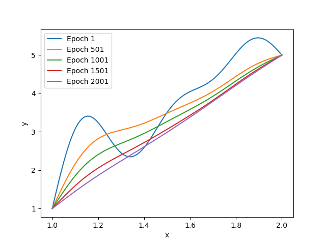
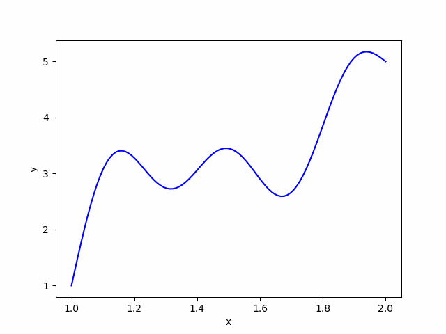

# FlameCalc
FlameCalc is a machine learning approach to a boundary problem of Calculus of Variation.

FlameCalc is built using PyTorch library, so please make sure the torch is installed on your device before installing
flamecalc.

### Introduction
Calculus of variation is the field of mathematics that aims to find a function (or a curve) that 
extremizes a given functional. For example, a very simple and famous example of the
calculus of variation is finding a path between two points on a 2-dimensional space. Such optimization problems 
are highly analogous to machine learning problems as the aim of both problem is to find a function 
that minimizes some value. Therefore, this package aims to solve such optimization problems using machine learning techniques.



### Installation
```
$ pip install flamecalc
```

### Usage

Suppose you want to find a shortest curve that connects two points on a 2-dimensional space.

Then, we can provide a functional such that

```{python}
import torch

def f(y, dy, x):
    return torch.sqrt(1 + dy**2)
```

Using the above functional, the length of the curve that connects two points will be 
an integration of the above functional.

Therefore, we use a flamecalc solver for this problem.

```{python}
A = (1, 1) # Starting point
B = (2, 5) # End point
domain = torch.linspace(A[0], B[0], 100) # domain

model = CalVarSolver(f, A, B, domain) # Get solver
epoch = 2500 # Hyperparameter
result = model.optimize(lr=0.02, epoch=epoch) # Optimize
```

With this simple code, you can solve the calculus of variation problem given with boundary conditions.

The curve evolves to a straight line as the learning progresses.


